# Changelog

## 0.4.2 — 4 October 2026

### Исправления по независимому аудиту

**Зарезервированные имена.** Ответ вспомогательной модели с id бонда или ключом стата `__proto__`, `constructor` или `prototype` раньше записывал историю статов в общий прототип объектов всей вкладки SillyTavern и мог сломать таверну и соседние расширения до перезагрузки страницы. Теперь парсер отбрасывает такие строки, а история пишет только собственные свойства.

**Черновики принадлежат чату.** Открытый редактор секции, пилюля «Вернуть» после удаления персонажа и заметка о броске закрываются при смене чата; «Сохранить» и «Вернуть» из прошлого чата больше не могут записать его данные в новый.

**Знаковые шкалы.** Редактор в раскладке по темам сохранял отрицательное значение знаковой шкалы как 0; теперь границы берутся из схемы.

**Запятые внутри строк.** Починка висячих запятых применяется, только если JSON не читается как есть; строка вроде «A note , ] intact» больше не портится.

**Сохранение во время сохранения.** Изменение, сделанное, пока предыдущее сохранение метаданных ещё в полёте, теперь досохраняется одним дополнительным запросом.

**Рост состояния.** Накопленные NPC и бонды ограничены 80 записями, досье 150: лишними уходят самые старые, которых нет в свежем ответе; присутствующие NPC не удаляются.

**Инъекция в одну строку.** Переводы строк и управляющие символы внутри значений состояния схлопываются в пробел перед вставкой в промпт основной модели.

**Формулировки.** Подсказки шкал для вспомогательной модели говорят «toward the target» вместо «toward toward».

### Fixes from the independent audit

**Reserved names.** A side-model reply whose bond id or stat key was `__proto__`, `constructor` or `prototype` used to write the stat history onto the shared object prototype of the whole SillyTavern tab, able to break the tavern and other extensions until a reload. The parser now drops such rows and the history writes own properties only.

**Drafts belong to a chat.** An open section editor, the Undo pill after a person delete and the roll note close on a chat switch; Save and Undo from the previous chat can no longer write its data into the new one.

**Signed scales.** The editor in the topics layout saved a negative signed score as 0; bounds now come from the schema.

**Commas inside strings.** Trailing-comma repair runs only when the JSON does not parse as is; a string like "A note , ] intact" is no longer damaged.

**A save during a save.** A change made while the previous metadata save is still in flight is now saved by exactly one follow-up request.

**State growth.** Accumulated NPCs and bonds are capped at 80, dossiers at 150: the oldest ones missing from the fresh reply go first; present NPCs are never dropped.

**One-line injection.** Newlines and control characters inside state values collapse to a space before the text enters the main model's prompt.

**Wording.** Scale hints for the side model say "toward the target" instead of "toward toward".

## 0.4.1 — 4 October 2026

### Какое состояние уходит в промпт; устойчивость запросов

**Свайп, реген, продолжение.** При свайпе, регенерации или продолжении последнего ответа в промпт уходит состояние **до** этого ответа, а не пересказ того, что вы переписываете. Инжект ставится в момент старта генерации, а не только по событиям сообщений.

**Отставание.** Если состояние отстаёт от чата на один ответ (запуск ещё идёт или упал один раз), оно уходит с пометкой «на момент ответа #N, новые сообщения главнее». Если отстаёт на два и больше, в промпт не уходит ничего, а в статусе и на карточках видно «Состояние отстаёт на M ответов» с кнопкой ⟳.

**Запрос к вспомогательной модели.** Если провайдер отвергает параметры «Размышления модели» (HTTP 400 «unsupported parameters», так ведёт себя лейн Gemini на некоторых прокси), запрос один раз повторяется без них, и профиль запоминается до перезагрузки. Обрезанный ответ даёт сообщение «Ответ обрезан: модель не дописала JSON. Увеличьте «Макс. токенов» (сейчас N) или уменьшите размышления», пустой — «Модель вернула пустой ответ (фильтр содержимого?)». Лимит токенов по умолчанию для новых установок 8000; токены размышлений считаются в него.

**Запрос подписан по именам.** Блоки карточки и персоны в запросе названы: кто персонаж ИИ, кто персонаж пользователя.

### Which state is injected; request resilience

**Swipe, regenerate, continue.** When the last reply is swiped, regenerated or continued, the prompt carries the state **before** that reply, not a retelling of what you are rewriting. The injection is set when generation starts, not only on message events.

**Lag.** When the state is one reply behind the chat (a run still going, or one failure), it is injected with a note "as of reply #N; newer messages take precedence". Two or more replies behind: nothing is injected, and the status and the cards show "State is M replies behind" with the ⟳ control.

**Side-model request.** If the provider rejects the "Model reasoning" parameters (HTTP 400 "unsupported parameters", the behaviour of Gemini lanes on some proxies), the request is retried once without them and the profile is remembered until reload. A cut reply reports "The reply was cut: the model did not finish the JSON. Raise Max tokens (now N) or reduce reasoning"; an empty one "The model returned nothing (content filter?)". The default token limit for new installs is 8000; reasoning tokens count against it.

**Request labelled by name.** The card and persona blocks say who is the AI's character and who is the user's.

## 0.4.0 — 3 October 2026

### Перенос пальцем, карандаш у персонажа, история статов, подсказки, настройки в один этаж

**Перенос карточек между группами.** Карточку можно взять за ручку и унести в другую группу, вытащить из группы или положить в пустую: там, где она ляжет, появляется пунктирный слот «сюда». Паки и группа «Люди» карточки не принимают и приглушаются. Внизу панели на пять секунд всплывает пилюля **«Вернуть»**; она же откатывает удаление группы (теперь в один тап) и «Разложить по группам». Меню «В группу…» осталось.

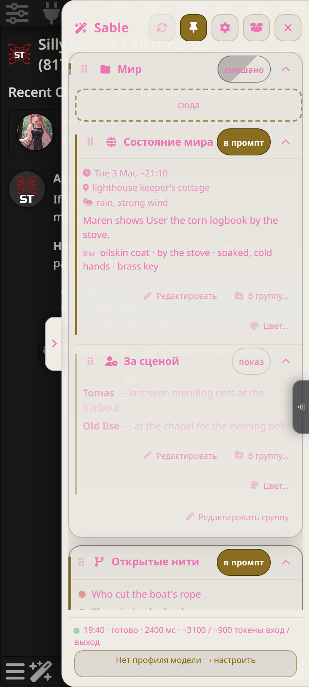
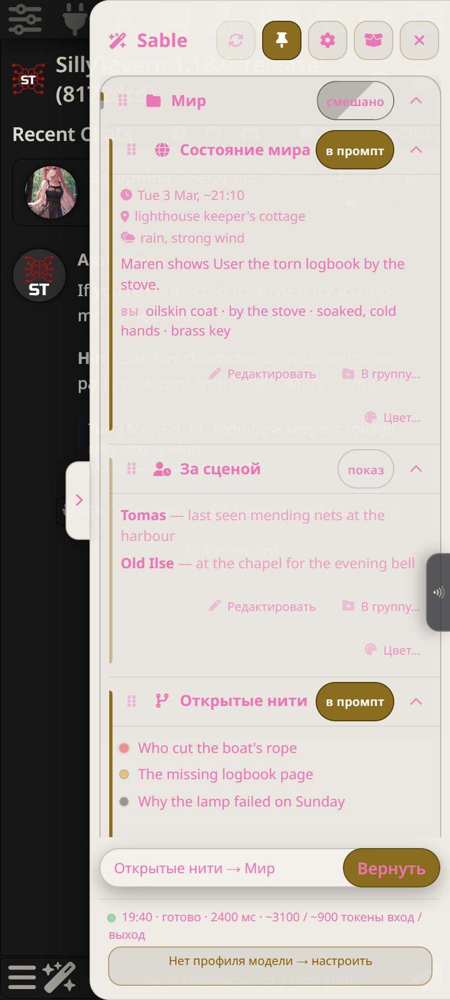

**Карандаш на карточке человека.** В раскладке «по персонажам» у каждой карточки человека карандаш в шапке: **«Редактировать»** открывает форму прямо в карточке (персонаж, тайна и «на самом деле», мысль, отношения, досье; недостающие части добавляются кнопками «+»), **«Удалить»** убирает человека из всех четырёх секций с пилюлей «Удалено: … · Вернуть». В подвале группы «Люди» — **«+ Человек»**. Всё пишется одним сохранением: либо целиком, либо ничего. Модель может вернуть удалённого персонажа, пока он есть в тексте.

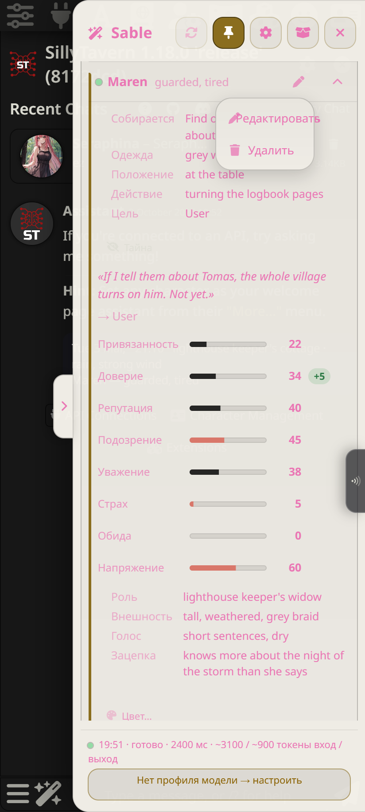
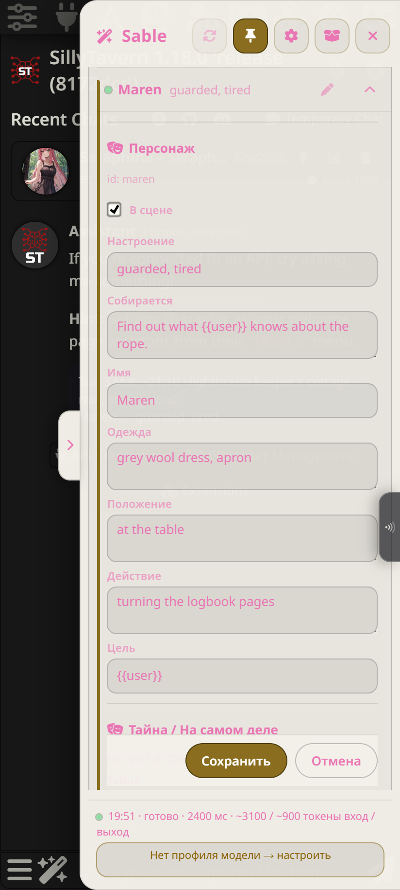

**История статов паков.** Полоски паков (HP, выносливость, возбуждение, оргазм) получили те же мини-графики, что шкалы отношений. Тап по столбику любого мини-графика показывает «ответ #N · значение» и прокручивает чат к этому сообщению, если оно загружено. Счётчики без максимума истории не ведут. Галочка теперь называется «Мини-графики под полосками».

**Подсказки и статус.** При первом открытии панели четыре короткие подсказки: «Проверь соединение» с выбором профиля прямо в ней, «Выбери, что нравится», «Всё меняется в карточках», «Наслаждайся»; у каждой галочка «Больше не показывать», в настройках кнопка «Показать подсказки снова». Пока профиль не выбран, в статусе кнопка «Нет профиля модели → настроить». Галочка «Пересчитать после правки ответа» убрана: после правки статус показывает «Состояние устарело · ⟳ Пересчитать». Каждое меню режима заканчивается легендой: в промпт — модель это видит, показ — только тебе, выкл — не обновляется.

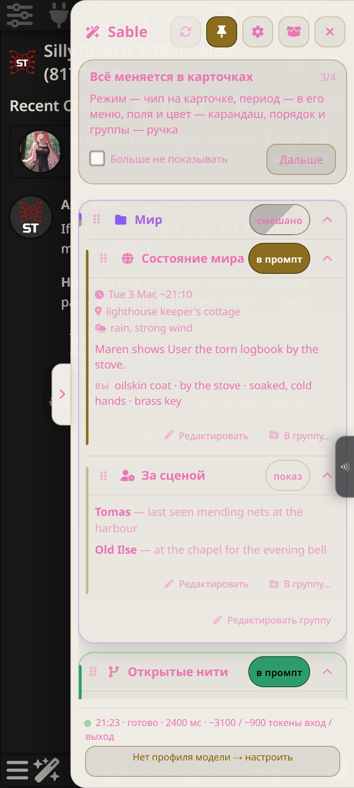
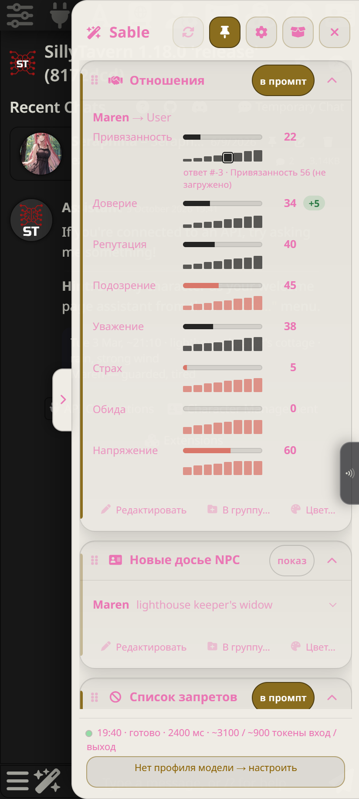
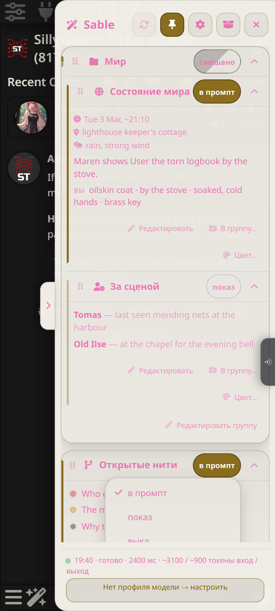

**Настройки в один этаж.** У свёрнутой группы настроек под названием перечислено, что внутри; наверху одна строка: что меняется в карточках, а что здесь. Период — в меню чипа режима («Раз в N ответов»). Цвет карточки — последней строкой в её редакторе, цвет группы — в «Редактировать группу»; оба применяются сразу. Импорт из старого Sable стал плашкой в панели, которая появляется только когда в чате есть старые данные.

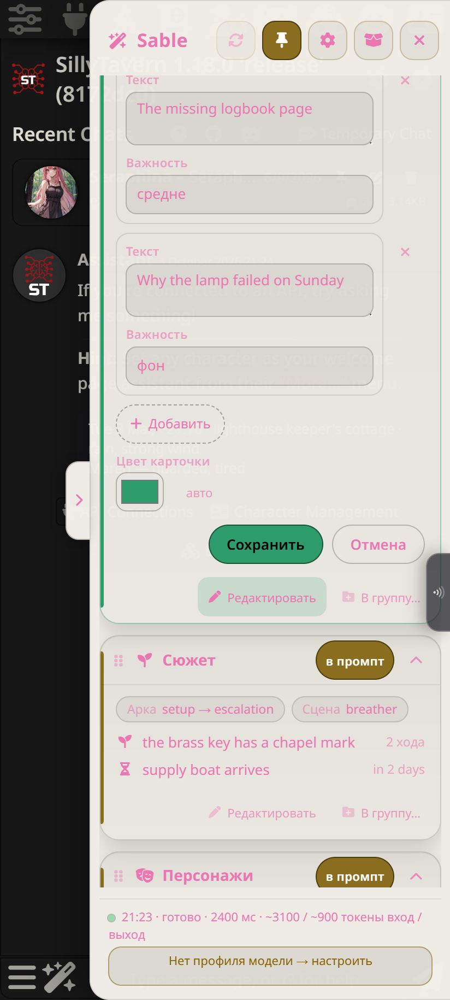
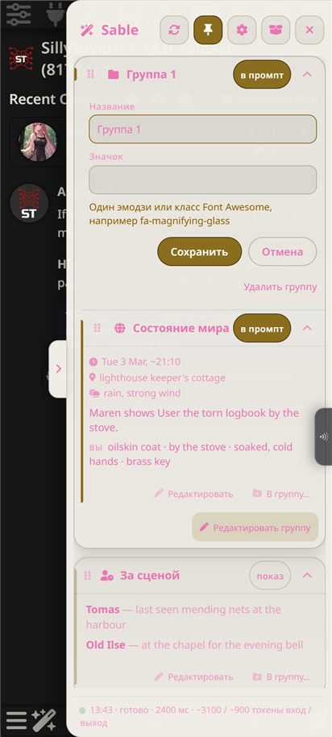

**Интим+.** Две новые карточки, обе в промпт: **«Влажность»** (шкала 0–100 по описанным признакам) и **«Семя»** (куда, сколько раз и объём, накопительно в пределах сцены). Взрослый гард тот же.

**Запрос к вспомогательной модели.** Блоки карточки и персоны подписаны по именам: кто персонаж ИИ, кто персонаж пользователя. Дешёвая модель больше не путает, чьи глаза какого цвета.

### Finger drag, a pencil on the person card, stat history, hints, settings on one level

**Drag between groups.** Take a card by its handle and carry it into another group, out of a group, or into an empty one: a dashed "here" slot shows where it lands. Packs and the People group do not accept cards and dim. An **Undo** pill appears at the bottom of the panel for five seconds; it also reverts a group delete (now one tap) and Suggested groups. The Group… menu stays.

**A pencil on the person card.** In the people layout every person card has a pencil in its header: **Edit** opens a form inside the card (character, secret and deep down, thought, bonds, dossier; missing parts are added with "+" buttons), **Delete** removes the person from all four sections with a "Deleted: … · Undo" pill. The People group footer gains **+ Person**. Everything is written in one save: all or nothing. The side model may add a deleted character back while the text still mentions them.

**Stat history.** Pack bars (HP, stamina, arousal, climax) get the same sparklines as bond scales. Tapping a bar on any sparkline shows "reply #N · value" and scrolls the chat to that message when it is loaded. Counters without a maximum keep no history. The checkbox is now "History sparklines under bars".

**Hints and status.** On the first opening of the panel, four short hints: "Check the connection" with the profile select inside, "Pick what you like", "Everything changes in the cards", "Enjoy"; each has "Don't show again", and Settings → Actions has "Show the hints again". While no profile is selected the status shows "No model profile → set up". The "Recompute after editing a reply" checkbox is gone: after an edit the status shows "State is stale · ⟳ Recompute". Every mode menu ends with a legend: inject — the model sees it, show — only you, off — not updated.

**Settings on one level.** A folded settings group lists what it holds under its title; one line at the top says what is changed in the cards and what is here. The period lives in the mode chip menu ("Every N replies"). The card colour is the last row of the card editor, the group colour is in "Edit group"; both apply immediately. The legacy import became a banner in the drawer that appears only when the chat has old Sable data.

**Intimacy+.** Two new cards, both injected: **Wetness** (a 0–100 scale from described signs) and **Cum** (where, how many times and how much, cumulative within the scene). The same adult guard.

**Side-model request.** The card and persona blocks are labelled by name: who is the AI's character and who is the user's. A cheap model no longer mixes up whose eyes are which colour.

## 0.3.0 — 3 October 2026

### Шкалы по выбору, раскладка по персонажам, визуал отношений, «Интим+»

**Шкалы отношений** (Настройки → «Шкалы отношений»). Десять встроенных шкал включаются и выключаются по одной, с подписью, что каждая меряет; до шести своих шкал с ключом, названием, фразой для вспомогательной модели и флажком «Высокое значение = трение». Выключенная шкала исчезает из панели, промпта и схемы; инструкция по умолчанию пересобирается из включённых, а своя инструкция в «Опасной зоне» заменяет её целиком.

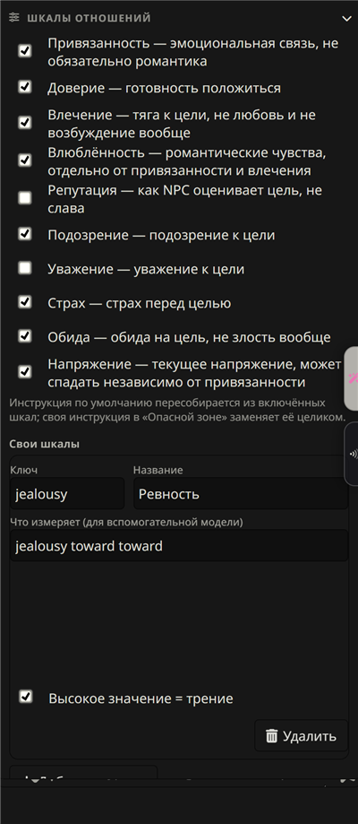
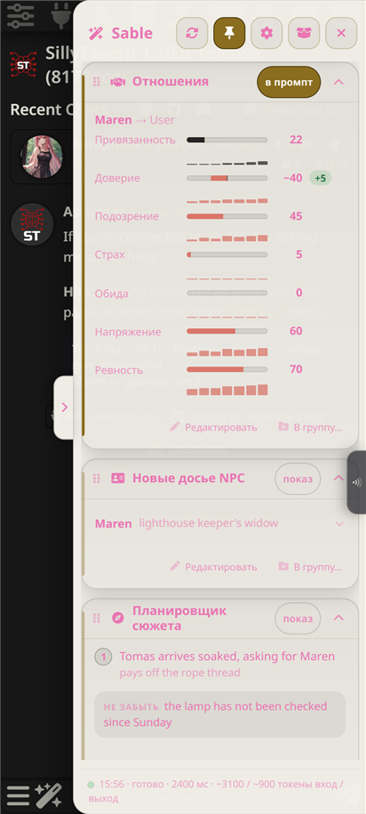

**Визуал отношений.** Под каждой шкалой мини-график за последние двенадцать ответов (Внешний вид → Карточки → «Мини-графики под шкалами»). У любой шкалы, встроенной или своей, галочка «−100…+100»: полоска идёт от центра, влево тёплым, вправо акцентом, число со знаком; модели дописывается, что минус означает противоположное чувство. Сохранённые значения при переключении не меняются.

**Раскладка «по персонажам»** (Настройки → Секции → «Раскладка панели»). Вместо карточек «Персонажи», «Мысли», «Отношения» и «Досье» одна группа «Люди», а внутри по карточке на каждого NPC: присутствие, настроение, «Собирается» и поля, «Тайна» за спойлером, мысль, полоски отношений, досье. Остальные карточки, паки и папки как были. Редактирование пока в раскладке по темам.

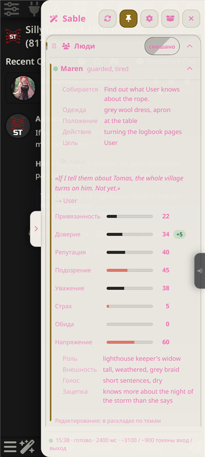
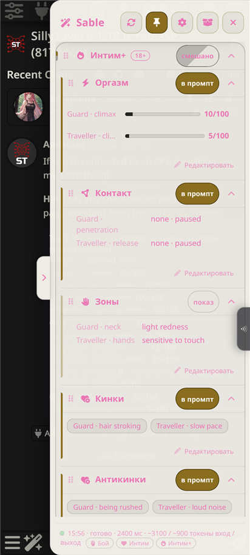
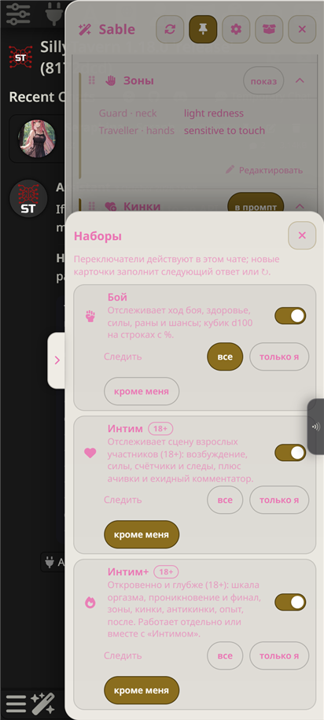

**Пак «Интим+ (18+)».** Второй, более откровенный пак, включается отдельно или вместе с «Интимом»: «Оргазм» шкалой накопления, «Контакт» (проникновение, финал), «Зоны» по отдельности, «Кинки» и «Антикинки» только из показанного опыта, «Опыт» как журнал, «После» как состояние после акта. Взрослый гард и охват «кроме меня» те же.

### Scales by choice, layout by people, bond visuals, Intimacy+

**Bond scales** (Settings → Bond scales). The ten built-in scales switch on and off one by one, each with a one-line description; up to six custom scales with a key, a title, a sentence for the side model and a "High value = friction" flag. A switched-off scale leaves the drawer, the prompt and the schema; the default instruction is rebuilt from the enabled scales, while an override in the Danger zone replaces it whole.

**Bond visuals.** A small history line under each scale for the last twelve replies (Appearance → Cards → "History sparklines under scales"). Any scale, built-in or custom, can be signed with a "−100…+100" checkbox: the bar grows from the centre, warm to the left and accent to the right, the number signed; the side model is told that negative means the opposite feeling. Stored values are not rewritten.

**Layout by people** (Settings → Sections → "Drawer layout"). Instead of the NPCs, NPC Inner Chatter, Bonds and New NPC Dossiers cards, one "People" group with a card per NPC: presence, mood, About to and the fields, the Secret spoiler, the thought, the bond bars, the dossier. Everything else renders as before. Editing stays in the topics layout for now.

**Intimacy+ pack (18+).** A second, more explicit pack that works alone or with Intimacy: Climax as a build-up scale, Contact (penetration, release), Zones one by one, Kinks and Dislikes only from shown experience, Experience as a log, Afterglow as the state after the act. The same adult guard and "everyone but me" scope.

## 0.2.0 — 3 October 2026

### Группы, тайны и инструкции по пакам

**Группы.** Карточки можно складывать в свои группы, как категории в Discord. Под карточкой появилась кнопка **«В группу…»**: список ваших групп, «Без группы», «Новая группа…». У группы та же шапка, что у пака: ручка, значок с названием, общая плашка режима (один тап переключает все карточки внутри), сворачивание. Внизу группы **«Редактировать группу»**: название, значок, удаление в два тапа (карточки возвращаются в список). Группы общие для всех чатов. **Настройки → Секции → «Разложить по группам»** создаёт «Мир», «Люди» и «Сюжет» одним тапом.

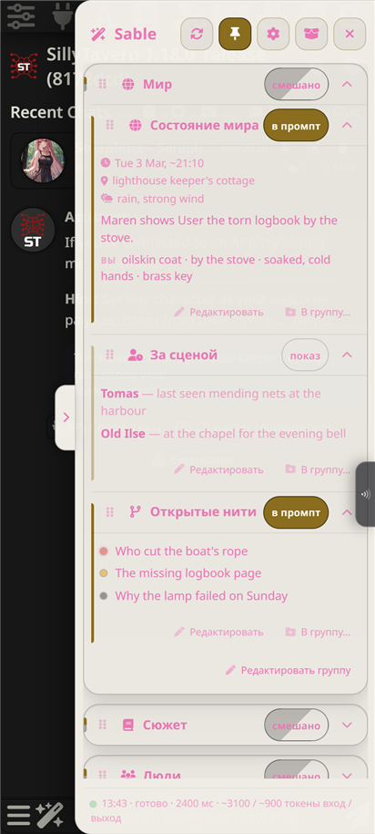
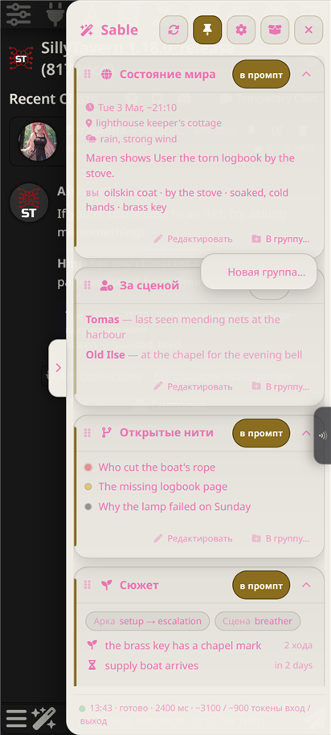

**Тайна и «На самом деле».** В строке персонажа первым идёт **«Собирается»** (что NPC собирается сделать прямо сейчас), а тайна и новое поле **«На самом деле»** (одна фраза о том, что он правда чувствует под тем, что показывает) спрятаны за кнопкой **«Тайна»**. Новый ответ персонажа или смена чата закрывают спойлеры обратно. В основной промпт эти поля не попадают. Галочка **Настройки → Секции → «Тайны и «на самом деле» за спойлером»** выключает прятки.

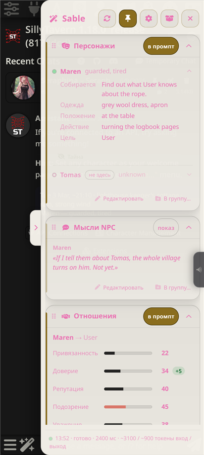
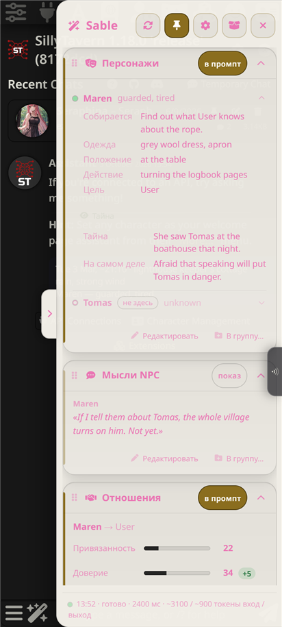

**Инструкции по пакам.** В «Опасной зоне» инструкции встроенных паков сгруппированы: правила набора первой строкой, затем карточки пака, с пометкой «изменено» на шапке, если что-то внутри отличается от умолчания.

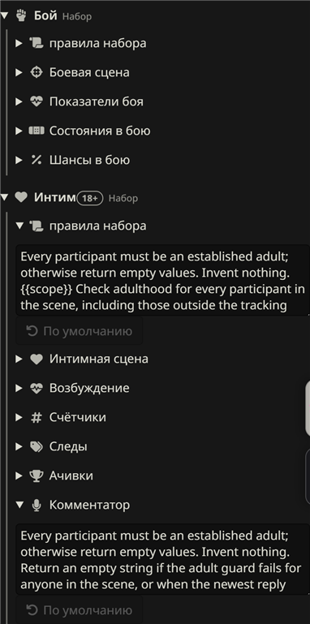

**Интим: две весёлые карточки.** **«Ачивки»** (значки в духе игровых достижений за явные события в тексте) и **«Комментатор»** (одна-две ехидные фразы голосом спортивного комментатора, документалки о природе, таблоида или телешоу). По умолчанию только показ, в промпт не идут, взрослый гард тот же.

### Groups, secrets and instructions by pack

**Groups.** Cards can be put into your own groups, like Discord categories. A card's footer gained **Group…**: your groups, **No group**, **New group…**. A group has the same header as a pack: handle, icon and title, a shared mode chip (one tap switches every card inside), fold. The group ends with **Edit group**: title, icon, a two-tap delete (the cards return to the list). Groups are global across chats. **Settings → Sections → Suggested groups** creates World, People and Story in one tap.

**Secret and Deep down.** The NPC row starts with **About to** (what the NPC is about to do), while the secret and the new **Deep down** field (one phrase of what the NPC really feels beneath the shown behaviour) sit behind a **Secret** button. A new reply or a chat change hides them again. Neither field enters the main prompt. **Settings → Sections → Secrets and truths behind a tap** turns the hiding off.

**Instructions by pack.** In the Danger zone the built-in packs' instructions are grouped: the pack rules first, then the pack's cards, with a "changed" badge on the group while anything inside differs from the default.

**Intimacy: two playful cards.** **Achievements** (video-game style badges for explicit events) and **Commentator** (a tongue-in-cheek line or two in the voice of a sports commentator, a nature documentary, a tabloid or a dating show). Shown by default, not injected, the same adult guard.

## 0.1.0 — 30 September 2026

Initial public release.
